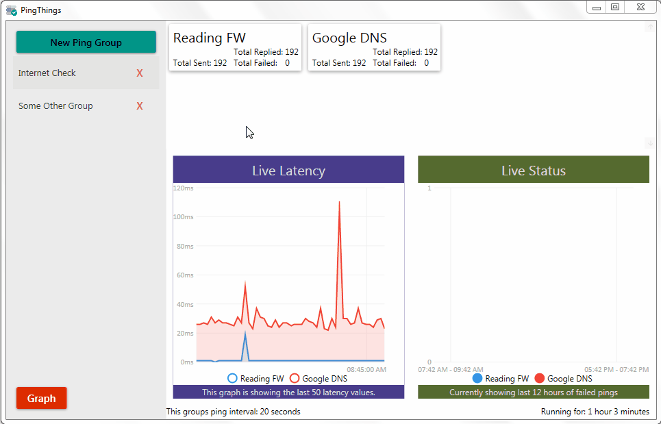
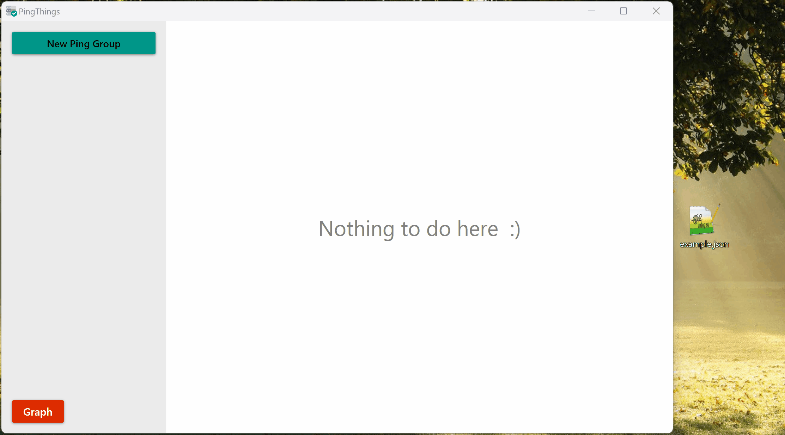
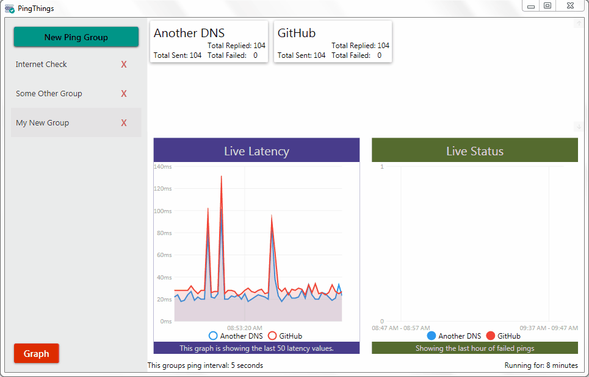
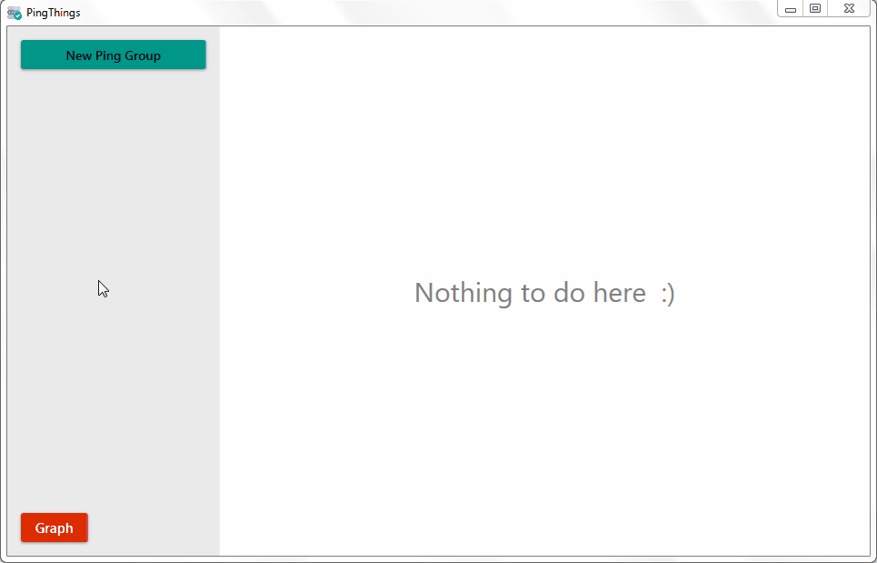

# PingThings
<h3>Description</h3>
A fancy ping tool with graphs and stuff. 

Collect long running connection latency and status information, and view the data in a graph.

Here are some gifs...

<h3>Adding a New Ping Group</h3>



<h3>Adding a New Ping Group from a File</h3>

example.json:
```json
{
  "groupname": "Example drop file",
  "pings": [
    {
	  "label": "Google Dns",
	  "host": "1.1.1.1"
	},
	{
	  "label": "Another Dns",
	  "host": "8.8.8.8"
	},
	{
	  "label": "Google.com",
	  "host": "www.google.com"
	}
  ]
}
```



<h3>Removing Ping Groups</h3>



<h3>Displaying Graphs</h3>


